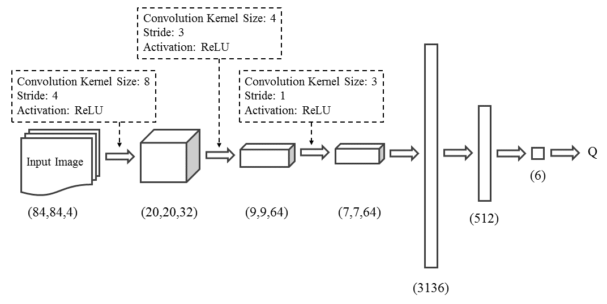
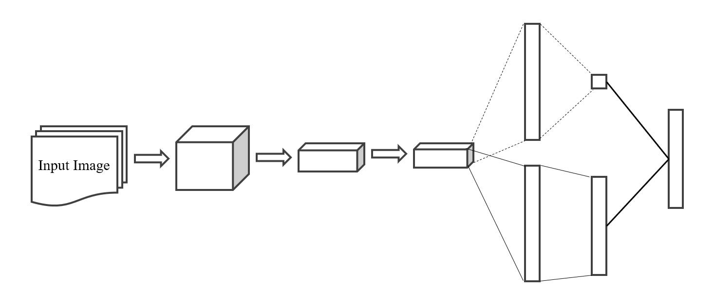
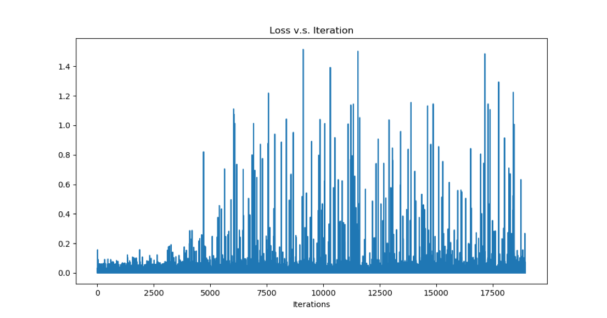
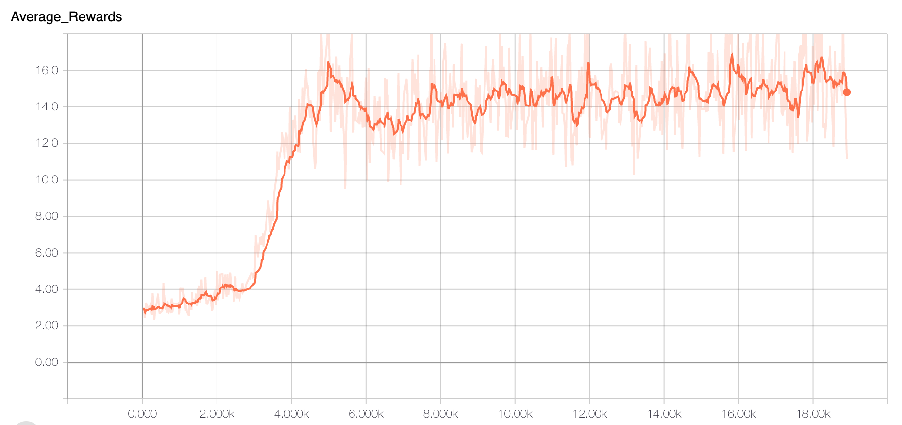
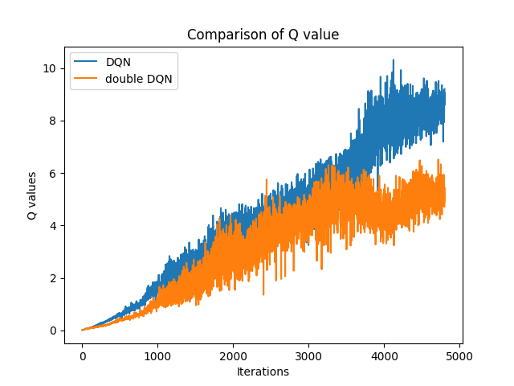
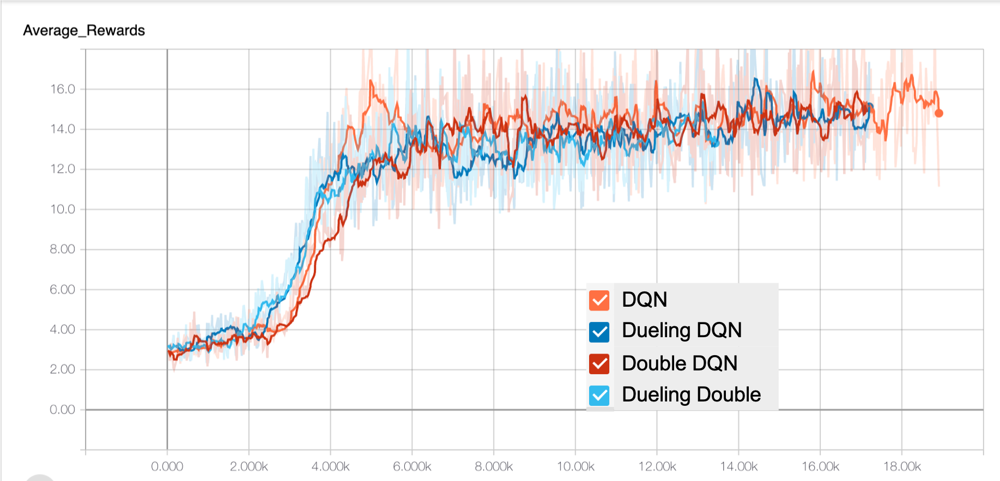

# GuarDiqN: Playing Space Invader with Dueling Double Deep Q-Network

In this project, we compare performance of DQN, Double DQN, Dueling DQN, and Dueling Double DQN on the Atari Game-Space Invaders.  

Group Members: Xin-Ling Bai, Hung-Ting Chen, Lin-Ying Cheng, Tsun-Hsu Lee, Hsuan-Chu Lin, Shih-Chen Lin

---

## Testing Environment

* CPU: Intel(R) Xeon(R) CPU E5-2630 v4 @ 2.20GHz
* GPU: GeForce GTX 1080 Ti (11172MB GRAM)
* RAM: 32GB
* TensorFlow version: `1.12.0`
* Python version: `3.6.8`

---

## Experiment

In this experiment, we use Convolution Neural Network (CNN) to extract features and predict Q values, since the input data is the image frame from the game. The images are resized into `84×84×3` (RGB images) and inputted into a 5-layer network, as we show in Figure 1. The first three layers are convolution layers with ReLU activation function, while the last two ones are fully connected layers, and we eventually get the Q values for each action.  

As for dueling DQN, we add one more layer to implement state value and advantage for each action, and then combine both of them as the output, shown in Figure 2.

|              DQN               |            Dueling DQN             |
| :----------------------------: | :--------------------------------: |
|  |  |

### Target and Evaluation Q Networks

In practice, there are two Q networks, which is Q **target network** and Q **evaluation network** respectively. They share the same structure but different values of parameters. The former is the network whose parameters are set to be trainable so that it can keep training and updating. By contrast, the latter is used to compute the loss for every action during training, so the parameters are not updating during the training process. Instead, it periodically updates to the values of Q target network. In this case, we assign values to it every 5000 frames The reason why we use two networks is to avoid the network destabilized by falling into the feedback loops between the target and estimated Q values. We initialize the weights of the Q evaluation network with truncated normal distribution whose mean is zero and covariance is set to be 0.01. Meanwhile, the weights of the Q target network are assigned by the same values.

* DQN: $Y_t^{DQN} \equiv R_{t+1}+\gamma \max_a Q(s_{t+1},a;\theta_t^{-})$  
  
* Double DQN: $Y^{DoubleDQN}_t \equiv R_{t+1}+ \gamma Q(s_{t+1},\arg\max_{a}Q(s_{t+1},a;\theta_t);\theta^\prime_t)$  

* Dueling DQN: $Q(s,a;\theta,\alpha,\beta) = V(s;\theta,\beta)+(A(s,a;\theta,\alpha)-\frac{1}{\mathcal{A}}\sum_{a'}A(s,a';\theta,\alpha))$

### Implementation for Double and Dueling DQN

In double DQN, we need two networks to decompose the max operation in the target into action selection and action evaluation. To implement this, we simply utilize the Q target and evaluation networks. The action itself is determined by the evaluation network, while the target network evaluates the quality of the action.  

As for dueling DQN, instead of the 5-layer architecture we mentioned previously, we add one more layer to introduce the state value and advantage for each action to the network respectively. Then both advantages and state values are combined as the output. We also implement both improvement skills into one model and accomplish the duelingdouble DQN.

### Parameter Setup

For optimization part, we use RMSProp algorithm to optimize the model with learning rate $2.5\times10^{-4}$. The batch size is set to be 32. Also, the $\gamma$ value is 0.99. The behavior policy during learning is $\epsilon$ greedy which means that the algorithm sometimes chooses the action randomly according to a decreasing $\epsilon$ value. The $\epsilon$ denotes the amount of randomness in our policy (action is greedy with probability (1 − $\epsilon$) and random with probability $\epsilon$), and it is decreased linearly from 1.0 to 0.1 within 106 frames and eventually fixed at 0.1. This enables the process start with a fairly randomized policy and later slowly move towards a deterministic policy.  

We also implement experience replay in the learning process. We initialize te replay memory buffer to capacity $10^5$, and the last 105 frames are stored into the buffer and sampled to train the network. Its randomness improves the policy, since it leads to different behavior and explore actions closer to optimal ones. We use one **GTX 1080 Ti** and **32 GB RAM** to train the model for 12 hours. Due to the hardware limitation, we are unable to train for longer time.

### Evaluation

In order to evaluate the results, we play the game with each model for 100 times and get their average rewards as our evaluation criteria. Note that we have clipped our rewards during training to avoid too much variance. However, in testing process, we unclipped the rewards to get the most genuine result.

---

## Results

### Deep Q-Networks (DQN)

We first proved our DQN model training curve could converge on the game Space Invaders from Atari 2600 using the Arcade Learning Environment [2]. The loss of the DQN model consisted of the mean square of the difference between the target Q value and predicted Q value. The target Q value is decomposed by the addition of actual reward and the original Q value times decay factors, while the predicted Q value is the prediction of our neural networks. We applied DMSProp Optimizer with a learning rate of 0.00025 and trained the model for 12 hours. The loss curve is illustrated in Figure 3.  

We could find out that the distribution of the loss is different from the loss curve we seem in the common image classification task. The reason is that our loss function consists of the difference between Q value, yet the value of the reward in the actual Q varies in each state and actions. To be more specific, in the game of space invader, players score higher when shooting the space ship while scoring lower if players shoot the aliens. Also, as the games proceeding, the reward for each action also fluctuates. Thus, the high variance of the reward makes DQN model even hard to prevent the loss from increasing. For our loss curve, we also found out that as it iterates over 4000 iterations, the actual reward of each action seems to get higher, which implies that the learning agent learns from playing the game.  

Because it is hard for us to determine whether the model converges, we then plotted the clipped reward curve versus iterations in Figure 4. This plot shows the average reward per steps of 100 epochs. We can find out that at the beginning, the reward is rendering at 2 to 4. However, after 4000 iterations, the average clipped reward skyrocketed to over 16. This result proves that our model could get a higher score from each action or we could interpret it as our agent could survive until the next level. Moreover, after 4000 iterations, the reward curve keeps increasing at a slower rate. This implies that our gaming agent is still learning but we could not know how smart he would be due to the hardware limitation. In summary, this plot proves that our model converges after 4000 iterations.

### Double DQN

To improve our model and make it more robust, we further analyzed the overestimation of DQN. We experimented with the same hyperparameters for DQN and Double DQN and trained each structure for 6 hours. In Figure 5, it indicates the maximum Q value at each given state. The blue line is the Q value distribution for DQN structure while the orange line is the Q value for Double DQN architecture. The plot demonstrates that the Q value of DQN keeps climbing as the iterations increase. This implies that DQN is consistently and sometimes vastly overoptimistic about the value of the current greedy policy. On the other hand, for the Q value distribution of the double structure, it is consistently lower than the Q value predicted by original DQN. We verified that the overestimation could be solved by utilizing the double architecture.  

It makes sense that Double DQN takes the advantages of the two networks, with the target network finding the action with the higher Q value, while updating the Q value using the Q value from the evaluated network. By avoiding the overestimation, the gaming agent would not be too optimistic toward certain actions.

### Dueling DQN

The Figure 6 shows the rewarding curve of the DQN structure (orange) comparing to the one of Dueling DQN (blue) on the game Space Invader. Apparently, both of the curves have similar achievement after the 6000 iterations. However, in the iterations between 2k and 4k, the network using Dueling Q value raised before the original DQN. It implies that the dueling architecture lies partly in its ability to lean the state-value efficiently. With every update of the Q values in the dueling architecture, the value stream V is updated this contrasts with the updates in a single-stream architecture where only the value for one of the actions is updated, the values for all other actions remain untouched. This more frequent updating of the value stream in our approach allocates more resources to V, and thus allows for a better approximation of the state values. Therefore, we believed that by applying the dueling structure, the learning agent could learn more faster and better.

### Dueling Double DQN

Knowing the fact that Double DQN could erase the overestimation of Q value and Dueling DQN allows the network to learn efficiently. We combined these structures and built a Dueling Double network leveraging the benefit of them. The 8 shows the clipped reward curve of all these models using the same hyperparameters training for 12 hours. Note that it might be uneasy for us to determine the reward curves of the four in the same plot, so we utilized the smooth mechanism in TensorBoard [1] making the plot more visually separable.  

Similar to the results from dueling structure, both of the Dueling DQN and Dueling Double DQN reward raised at 2000 iterations, while the two networks without dueling do not raise until about 3000 iterations. When iterations are above 8000, we found that all the four models seem to be smart enough that all the learning agent could choose the action that would have a higher reward.  

Concerning the fact that the reward is clipped during training to prevent too much variance. To get the more genuine result, we further inference all these models with unclipped rewards by testing 100 episodes and average their scores of the games. Then we select the best performance for each model. Note that we also take algorithms with random starts generated from expert human trajectories, as proposed by Nair et al. [7] as baselines. The results are shown in Table 1.  

We can find that DQN is capable of beating the baseline for over **15%** indicating our learning agent is smart enough. Double DQN performs better by over **63%** because we solve the overestimations issue from DQN. Dueling DQN allows the network to learn faster, making the agent smarter in a given time. Our optimized network Dueling Double DQN outperforms the baseline by **96%** because it leverages all the advantages. The combination of double network and the dueling network results in vast improvements over random agent.

---

## References

[1] M. Abadi, P. Barham, J. Chen, Z. Chen, A. Davis, J. Dean, M. Devin, S. Ghemawat, G. Irving, M. Isard, M. Kudlur, J. Levenberg, R. Monga, S. Moore, D. G. Murray, B. Steiner, P. A. Tucker, V. Vasudevan, P. Warden, M. Wicke, Y. Yu, and X. Zhang. Tensorflow: A system for large-scale machine learning. CoRR, abs/1605.08695, 2016.  

[2] M. G. Bellemare, Y. Naddaf, J. Veness, and M. Bowling. The arcade learning environment: An evaluation platform for general agents. CoRR, abs/1207.4708, 2012.  

[3] G. Lample and D. S. Chaplot. Playing FPS games with deep reinforcement learning. CoRR, abs/1609.05521, 2016.  

[4] V. Mnih, A. P. Badia, M. Mirza, A. Graves, T. P. Lillicrap, T. Harley, D. Silver, and K. Kavukcuoglu. Asynchronous methods for deep reinforcement learning. CoRR, abs/1602.01783, 2016.  

[5] V. Mnih, K. Kavukcuoglu, D. Silver, A. Graves, I. Antonoglou, D. Wierstra, and M. A. Riedmiller. Playing atari with deep reinforcement learning. CoRR, abs/1312.5602, 2013.  

[6] V. Mnih, K. Kavukcuoglu, D. Silver, A. A. Rusu, J. Veness, M. G. Bellemare, A. Graves, M. Riedmiller, A. K. Fidjeland, G. Ostrovski, S. Petersen, C. Beattie, A. Sadik, I. Antonoglou, H. King, D. Kumaran, D. Wierstra, S. Legg, and D. Hassabis. Human-level control through deep reinforcement learning. Nature, 518(7540):529–533, Feb. 2015.  

[7] A. Nair, P. Srinivasan, S. Blackwell, C. Alcicek, R. Fearon, A. D. Maria, V. Panneershelvam, M. Suleyman, C. Beattie, S. Petersen, S. Legg, V. Mnih, K. Kavukcuoglu, and D. Silver. Massively parallel methods for deep reinforcement learning. CoRR, abs/1507.04296, 2015.

[8] J. Schulman, F. Wolski, P. Dhariwal, A. Radford, and O. Klimov. Proximal policy optimization algorithms. CoRR, abs/1707.06347, 2017.  

[9] D. Silver, T. Hubert, J. Schrittwieser, I. Antonoglou, M. Lai, A. Guez, M. Lanctot, L. Sifre, D. Kumaran, T. Graepel, T. P. Lillicrap, K. Simonyan, and D. Hassabis. Mastering chess and shogi by self-play with a general reinforcement learning algorithm. CoRR, abs/1712.01815, 2017.  

[10] H. van Hasselt, A. Guez, and D. Silver. Deep reinforcement learning with double q-learning. CoRR, abs/1509.06461, 2015.  

[11] Z. Wang, N. de Freitas, and M. Lanctot. Dueling network architectures for deep reinforcement learning. CoRR, abs/1511.06581, 2015.  

[12] C. J. C. H. Watkins and P. Dayan. Q-learning. Machine Learning, 8(3):279–292, May 1992.